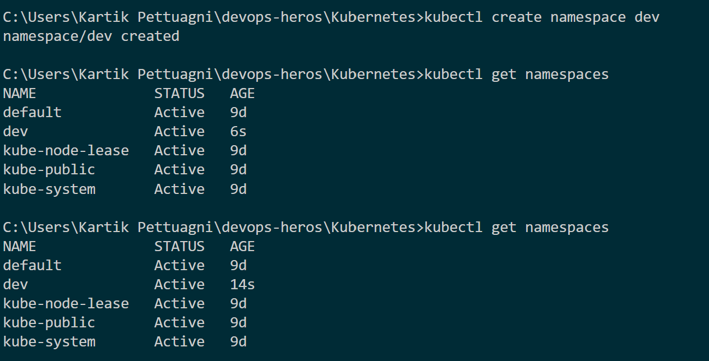
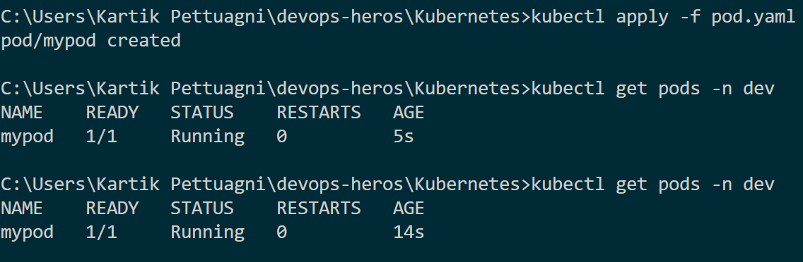
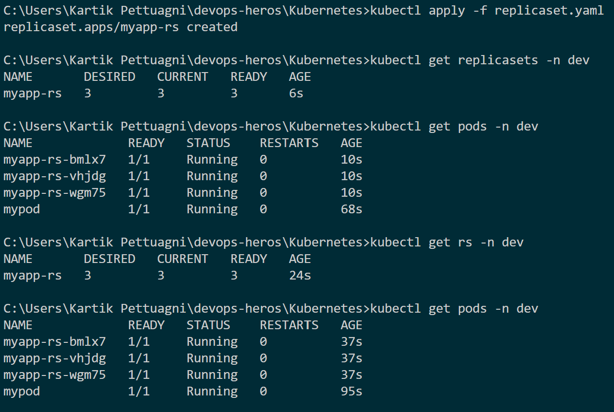
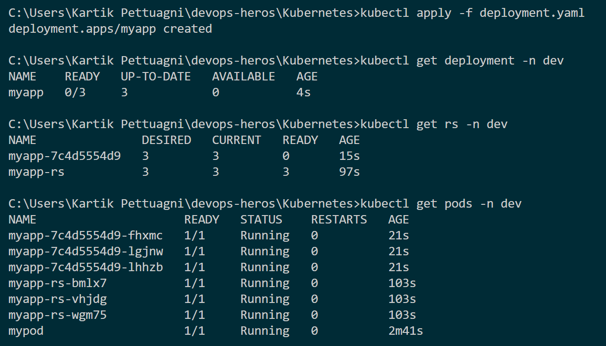
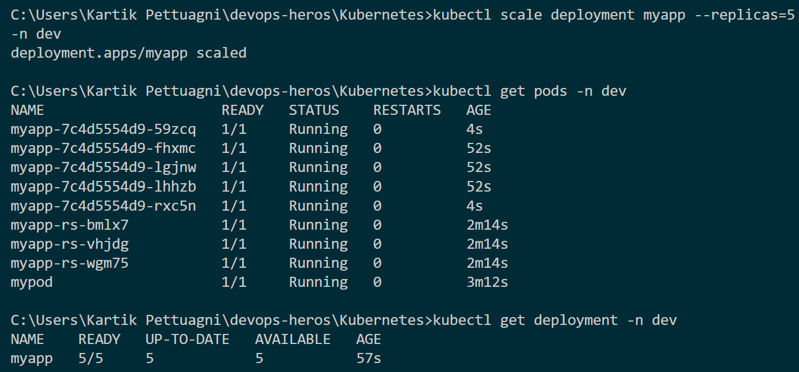
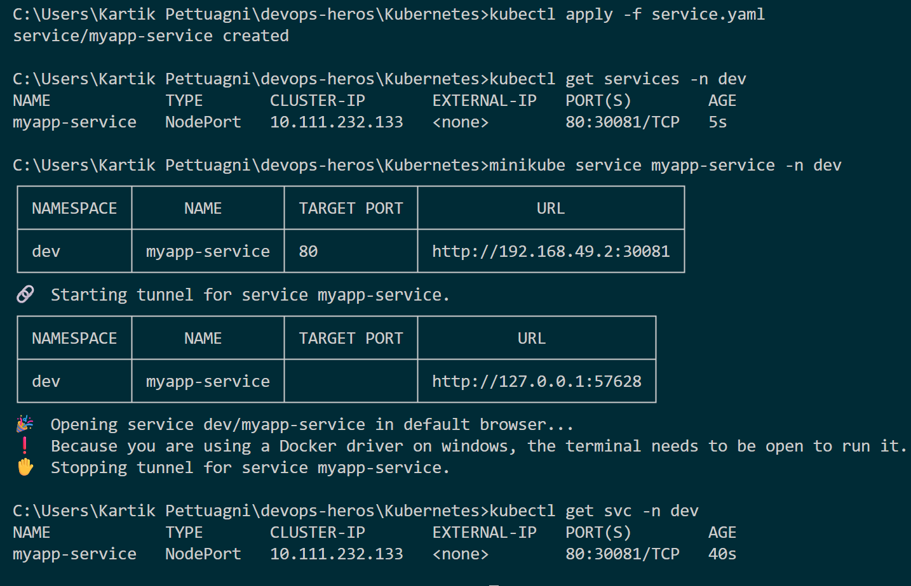
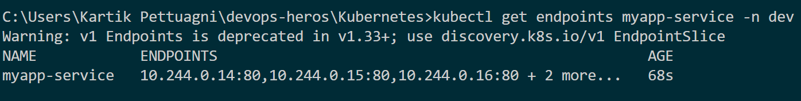
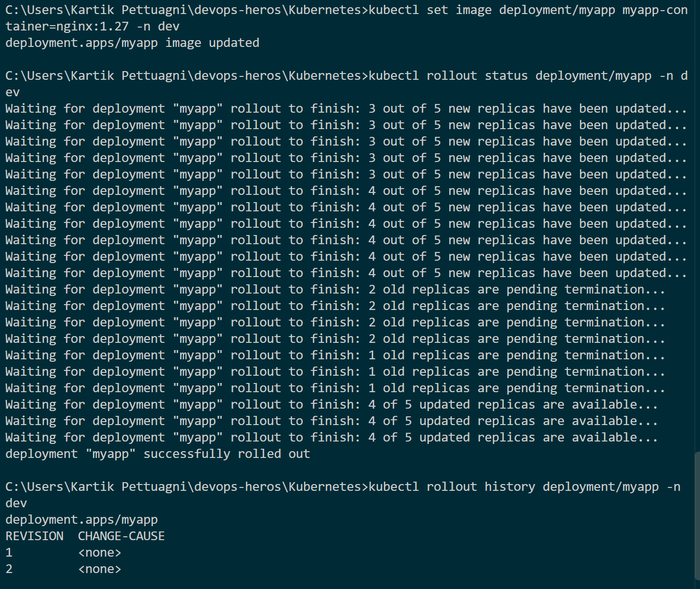
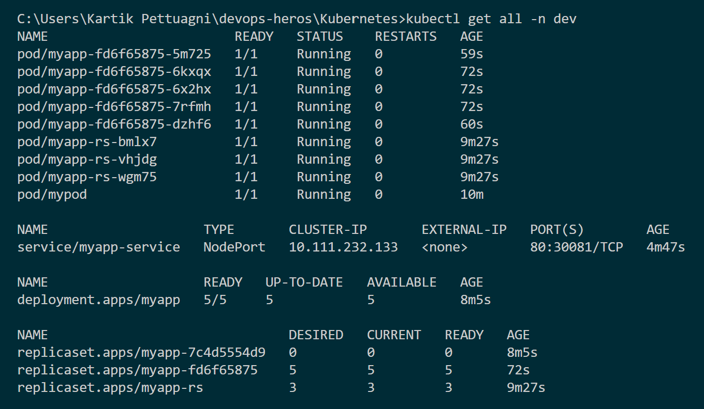

# Kubernetes Core Objects – DevOps Assignment

## Overview

This assignment demonstrates the core Kubernetes objects and how they work together in a local Minikube cluster.

The resources covered are:

1. **Namespace** – provides logical isolation for Kubernetes resources.
2. **Pod** – the smallest deployable unit in Kubernetes.
3. **ReplicaSet** – maintains a specified number of Pod replicas.
4. **Deployment** – manages ReplicaSets and provides declarative updates, scaling, and rollouts.
5. **Service** – provides stable networking and exposes Pods.

The main application resources were created inside the `dev` namespace.

---

## Environment

- **Kubernetes:** Minikube
- **Container Runtime:** Docker
- **CLI:** kubectl
- **Operating System:** Windows
- **Application Image:** NGINX

Working directory:

```text
C:\Users\Kartik Pettuagni\devops-heros\Kubernetes
```

---

# 1. Namespace

A Namespace provides logical isolation and grouping of Kubernetes resources.

The `dev` namespace was created using:

```bash
kubectl create namespace dev
```

The namespace was verified using:

```bash
kubectl get namespaces
```

The output confirms that the `dev` namespace is **Active**.

### Screenshot



---

# 2. Pod

A Pod is the smallest deployable unit in Kubernetes. It can contain one or more containers that share the same network namespace and can share storage volumes.

A Pod was created using the `pod.yaml` manifest:

```bash
kubectl apply -f pod.yaml
```

The Pod was verified using:

```bash
kubectl get pods -n dev
```

The output shows:

```text
mypod   1/1   Running   0
```

This confirms that the Pod was successfully created and is running inside the `dev` namespace.

### Screenshot



---

# 3. ReplicaSet

A ReplicaSet ensures that a specified number of identical Pods are running.

The ReplicaSet was created using:

```bash
kubectl apply -f replicaset.yaml
```

It was configured with:

```text
replicas: 3
```

The ReplicaSet was checked using:

```bash
kubectl get replicasets -n dev
```

The Pods were checked using:

```bash
kubectl get pods -n dev
```

The output confirms:

- Desired replicas: `3`
- Current replicas: `3`
- Ready replicas: `3`
- Three ReplicaSet Pods are in the `Running` state.

### Screenshot



---

# 4. Deployment

A Deployment provides declarative management of an application. It manages ReplicaSets, which in turn manage Pods.

The Deployment was created using:

```bash
kubectl apply -f deployment.yaml
```

The Deployment was verified using:

```bash
kubectl get deployment -n dev
```

The ReplicaSet created by the Deployment was checked using:

```bash
kubectl get rs -n dev
```

The Pods created by the Deployment were verified using:

```bash
kubectl get pods -n dev
```

This demonstrates the Kubernetes hierarchy:

```text
Deployment
     |
     v
ReplicaSet
     |
     v
Pods
```

### Screenshot



---

# 5. Scaling the Deployment

The Deployment was scaled from 3 replicas to 5 replicas using:

```bash
kubectl scale deployment myapp --replicas=5 -n dev
```

The Pods were then checked using:

```bash
kubectl get pods -n dev
```

The Deployment was verified using:

```bash
kubectl get deployment -n dev
```

The final output shows:

```text
READY        5/5
UP-TO-DATE   5
AVAILABLE    5
```

This demonstrates that Kubernetes automatically created additional Pods to reach the requested replica count.

### Screenshot



---

# 6. Service

A Service provides a stable networking endpoint for a group of Pods.

The application was exposed using a `NodePort` Service.

The Service was created using:

```bash
kubectl apply -f service.yaml
```

The Service was verified using:

```bash
kubectl get services -n dev
```

The output shows:

```text
TYPE      NodePort
PORT(S)   80:30081/TCP
```

This means:

- **Service Port:** `80`
- **Target Port:** `80`
- **NodePort:** `30081`

The Service was accessed using Minikube:

```bash
minikube service myapp-service -n dev
```

### Screenshot



---

# 7. Service Endpoints

The Service was checked to verify that it has endpoints corresponding to the running application Pods.

Command:

```bash
kubectl get endpoints myapp-service -n dev
```

The output shows multiple Pod IP addresses connected to port `80`.

This confirms that the Service selector is successfully routing traffic to the application Pods.

### Screenshot



---

# 8. Deployment Update and Rollout

The Deployment image was updated to:

```text
nginx:1.27
```

The image was updated using:

```bash
kubectl set image deployment/myapp myapp-container=nginx:1.27 -n dev
```

The rollout was monitored using:

```bash
kubectl rollout status deployment/myapp -n dev
```

The output confirms:

```text
deployment "myapp" successfully rolled out
```

The rollout history was also checked using:

```bash
kubectl rollout history deployment/myapp -n dev
```

The output shows two revisions, demonstrating that the Deployment recorded the update.

### Screenshot



---

# 9. Final Kubernetes Resources

Finally, all resources inside the `dev` namespace were displayed using:

```bash
kubectl get all -n dev
```

The final state shows:

### Pods

Five Pods managed by the current Deployment ReplicaSet are running successfully.

### Service

- **Name:** `myapp-service`
- **Type:** `NodePort`
- **Port Mapping:** `80:30081/TCP`

### Deployment

- **Name:** `myapp`
- **Ready:** `5/5`
- **Up-to-Date:** `5`
- **Available:** `5`

### ReplicaSets

The output shows the current ReplicaSet with 5 desired, current, and ready Pods. It also shows previous ReplicaSets created during the Deployment rollout.

### Screenshot



---

# Real-World Resource Flow

The Kubernetes resources demonstrated in this assignment work together as follows:

```text
                    Namespace
                       |
                       v
                  Deployment
                       |
                       v
                  ReplicaSet
                       |
              +--------+--------+
              |        |        |
              v        v        v
            Pod      Pod      Pod
              \        |       /
               \       |      /
                    Service
                       |
                       v
                  Application
```

### Explanation

**Namespace**

Groups and isolates resources logically. In this assignment, the namespace is `dev`.

**Deployment**

Manages the desired state of the application and creates/manages a ReplicaSet.

**ReplicaSet**

Ensures that the desired number of Pods are running.

**Pods**

Run the actual application containers. In this assignment, the application uses NGINX.

**Service**

Provides a stable networking endpoint and routes traffic to the appropriate Pods.

---

# Commands Used

## Namespace

```bash
kubectl create namespace dev
kubectl get namespaces
```

## Pod

```bash
kubectl apply -f pod.yaml
kubectl get pods -n dev
```

## ReplicaSet

```bash
kubectl apply -f replicaset.yaml
kubectl get replicasets -n dev
kubectl get pods -n dev
```

## Deployment

```bash
kubectl apply -f deployment.yaml
kubectl get deployment -n dev
kubectl get rs -n dev
kubectl get pods -n dev
```

## Scaling

```bash
kubectl scale deployment myapp --replicas=5 -n dev
kubectl get deployment -n dev
kubectl get pods -n dev
```

## Service

```bash
kubectl apply -f service.yaml
kubectl get services -n dev
minikube service myapp-service -n dev
```

## Service Endpoints

```bash
kubectl get endpoints myapp-service -n dev
```

## Deployment Update

```bash
kubectl set image deployment/myapp myapp-container=nginx:1.27 -n dev
kubectl rollout status deployment/myapp -n dev
kubectl rollout history deployment/myapp -n dev
```

## Final Verification

```bash
kubectl get all -n dev
```

---

# Conclusion

This assignment demonstrates the basic Kubernetes core-object workflow using Minikube.

The implementation covers:

- Namespace creation and isolation
- Pod creation and verification
- ReplicaSet-based Pod replication
- Deployment-based application management
- Scaling from 3 to 5 replicas
- Service exposure through NodePort
- Verification of Service endpoints
- Deployment image update
- Rollout monitoring and rollout history
- Final verification of Kubernetes resources

The screenshots included in this README provide evidence of each stage of the Kubernetes implementation.