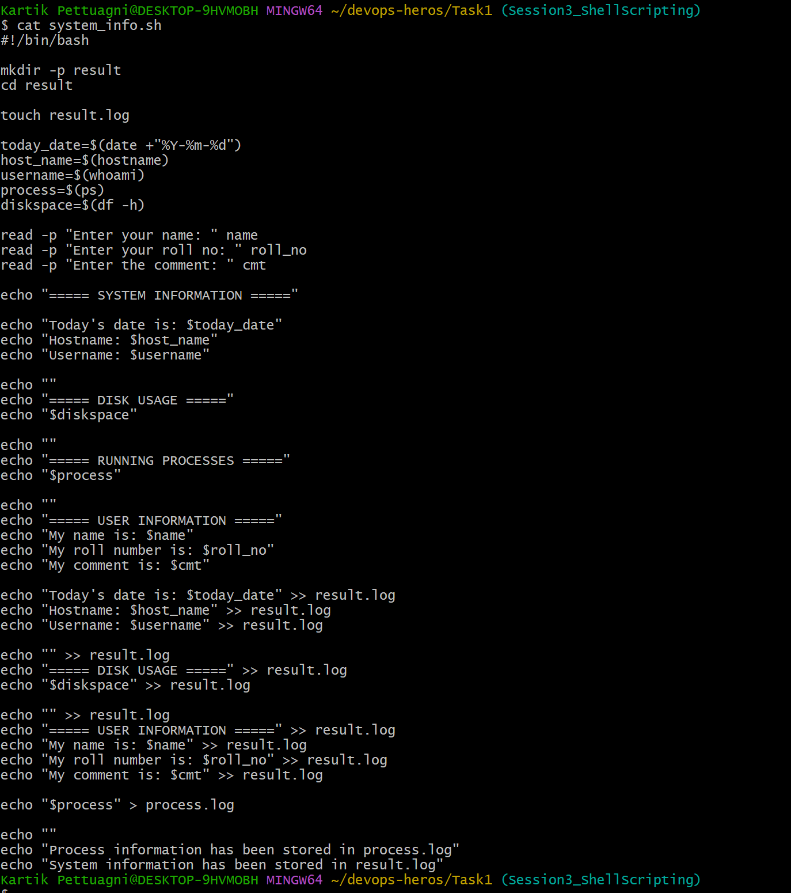
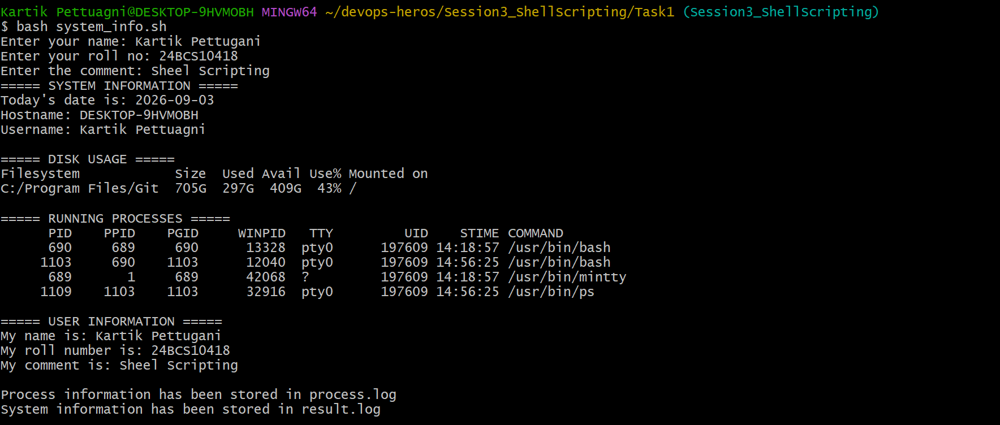
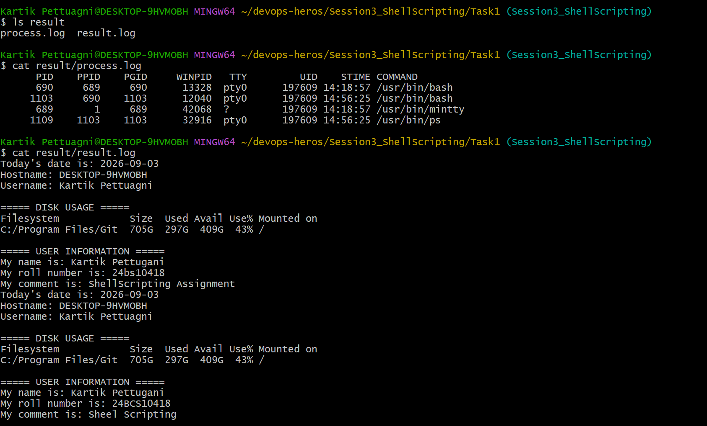

## 1. Shell Script

The following screenshot shows the completed shell script.

## 2. Script Execution

The following screenshot shows the script being executed with user input.

## 3. Generated Output Files

The following screenshot shows `process.log` and `result.log` containing the generated output.

