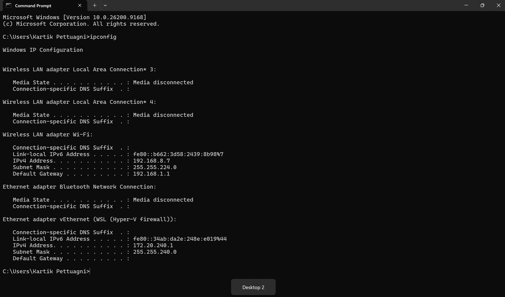
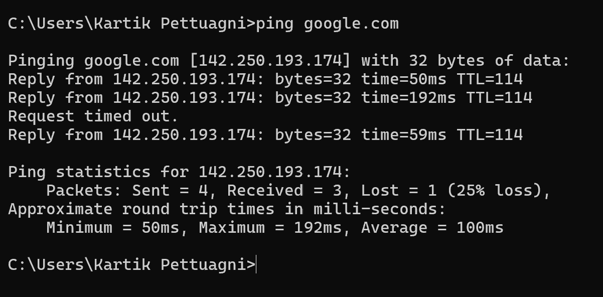
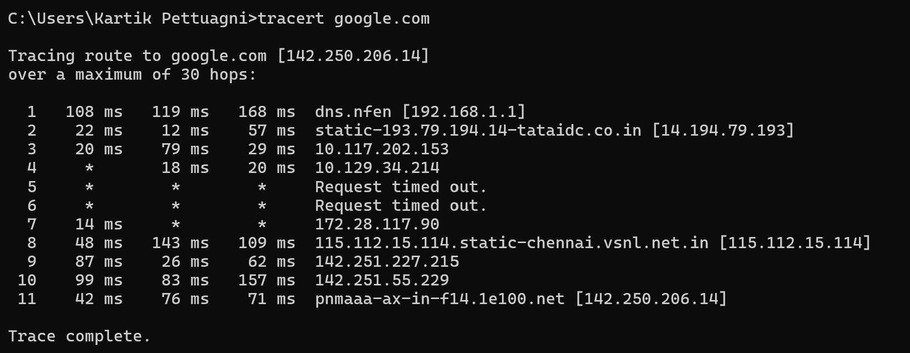
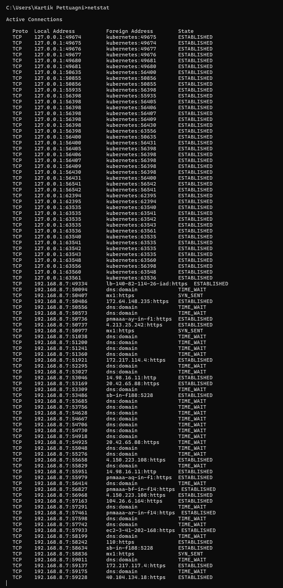
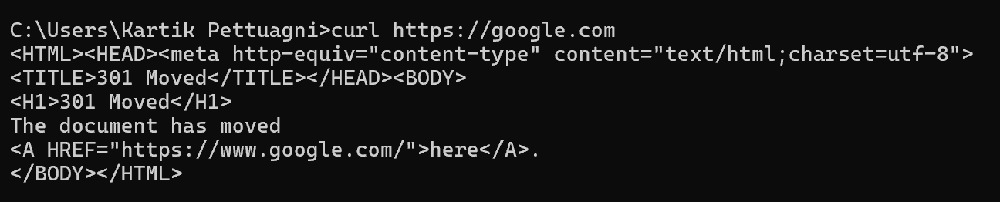

# Networking Homework - Task 2

## 1. ip a

Displays network interfaces and their IP addresses.

---

## 2. ping

Checks connectivity between the computer and another host.

---

## 3. traceroute

Shows the path taken by packets from the computer to the destination.

---

## 4. netstat

Displays active network connections and network-related information.

---

## 5. curl

Makes requests to a URL and retrieves data from a server.