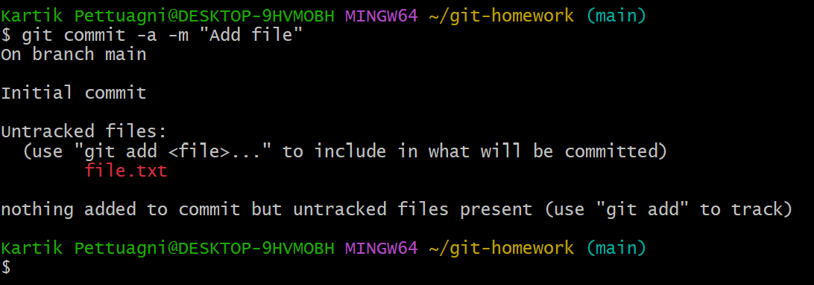
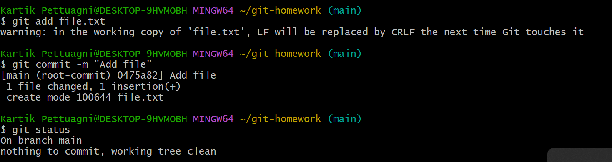
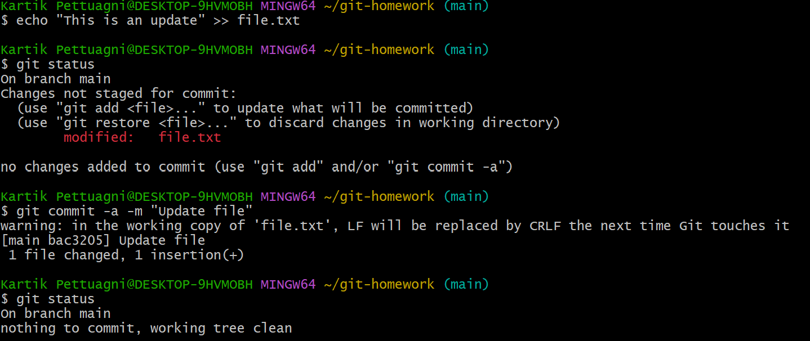
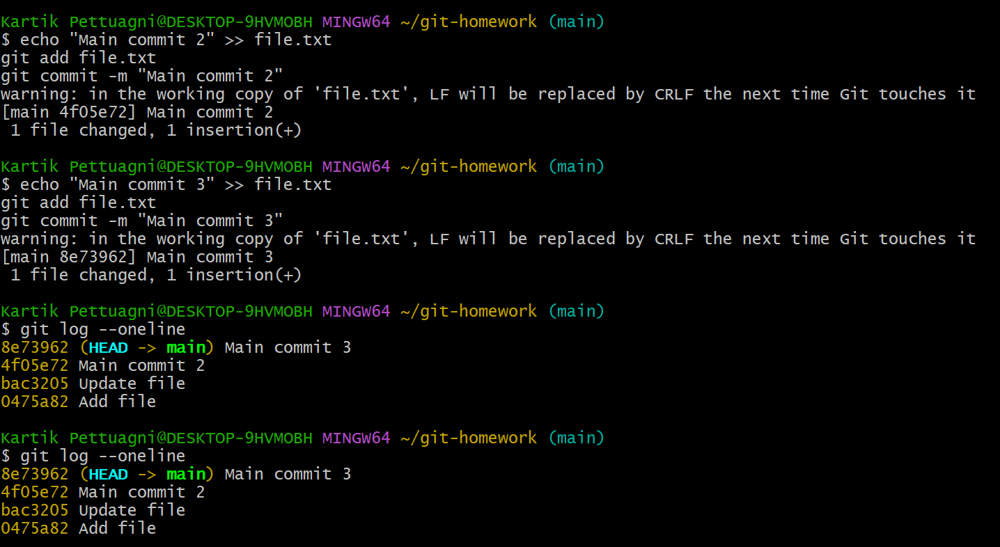
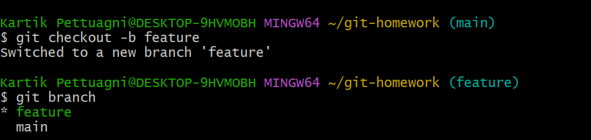
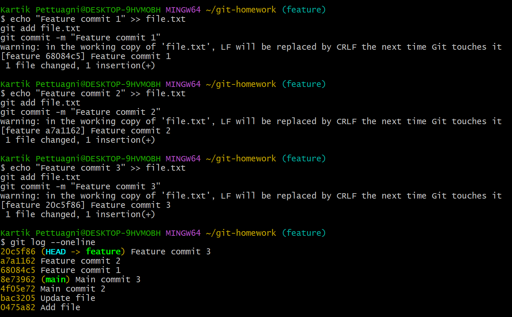
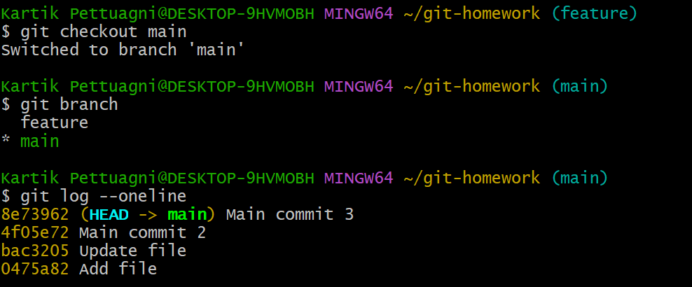
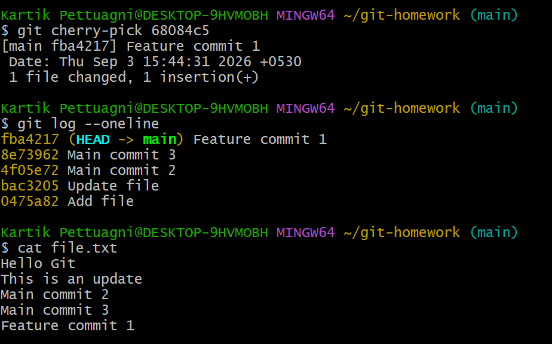

## Task 1

### git commit -a -m

**What it does:**  
Commits changes to already tracked files without using `git add`.

### git commit -m

**What it does:**  
Commits changes that have already been staged using `git add`.

### Update using git commit -a -m

**What it does:**  
Shows that a modified tracked file can be committed directly using `git commit -a -m`.

---

## Task 2

### git log --oneline

**What it does:**  
Shows the commit history in a short format.

### git checkout -b feature

**What it does:**  
Creates a new branch named `feature` and switches to it.

### Feature Branch Commits

**What it does:**  
Shows the commits created on the `feature` branch.

### git checkout main

**What it does:**  
Switches from the `feature` branch back to the `main` branch.

### git cherry-pick

**What it does:**  
Applies a specific commit from another branch to the current branch.

