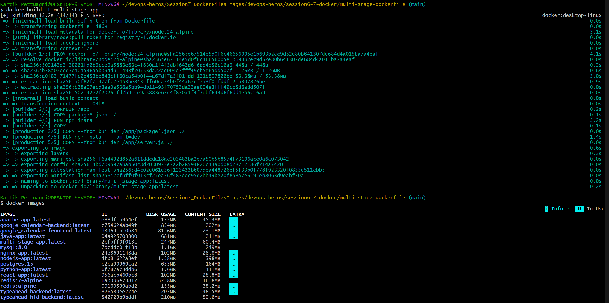
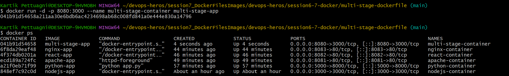
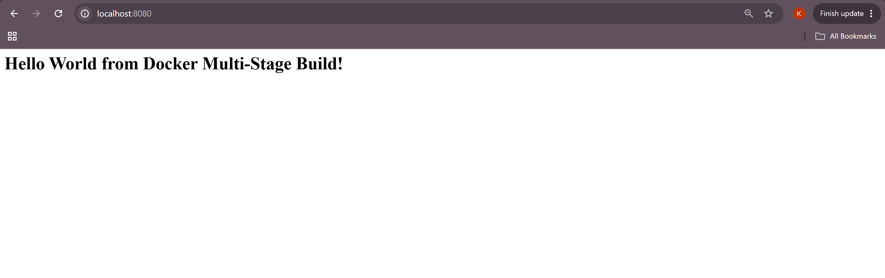
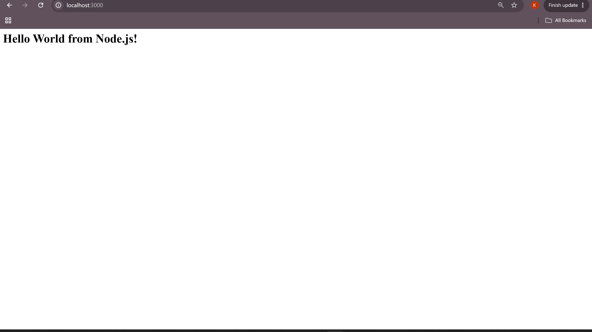
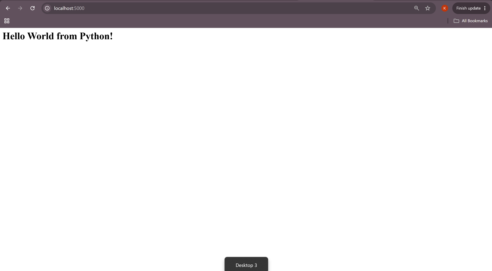
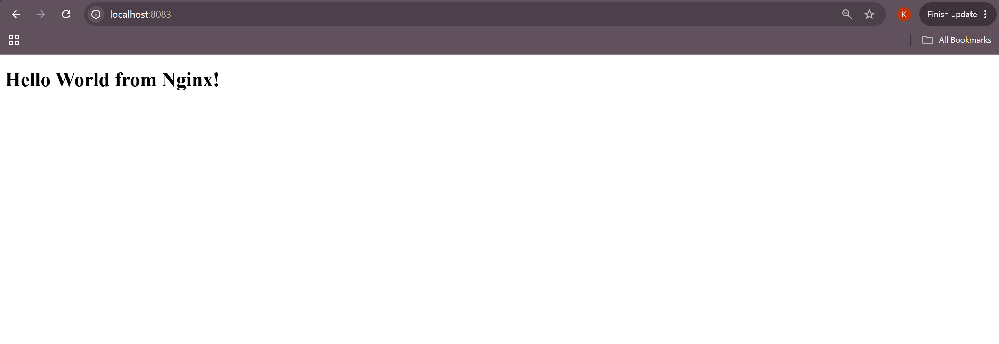

# Docker Multi-Stage Build Homework

## Task 1

### Multi-Stage Docker Build

**What it does:**  
Builds a Node.js application using a multi-stage Dockerfile.

### Application Output

**What it does:**  
Shows the Docker multi-stage application running successfully on port 8080.

### Docker PS

**What it does:**  
Shows the running Docker container and port mapping.

---

## Task 2

### Student Details

**Name:** Kartik Pettugani  
**RollNumber:** 24BCS10418

### Application Screenshot

### Running Container

---

## Task 3

### Node.js Application

Creates a simple Node.js application, builds it into a Docker image, runs it as a container, and accesses it through the browser.

### Python Application

Creates a simple Python application, builds it into a Docker image, runs it as a container, and accesses it through the browser.

### Nginx Appilcation
 
Creates a simple HTML page, serves it using Nginx inside a Docker container, and verifies the running container..

