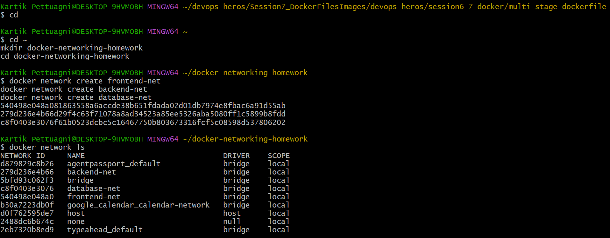
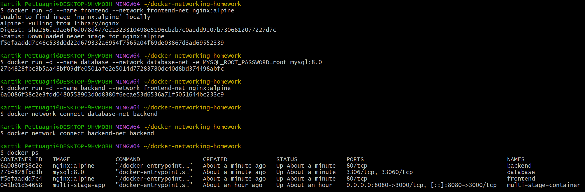
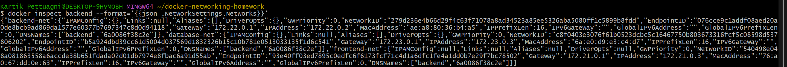
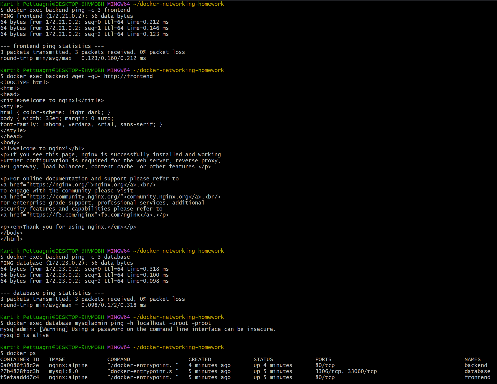
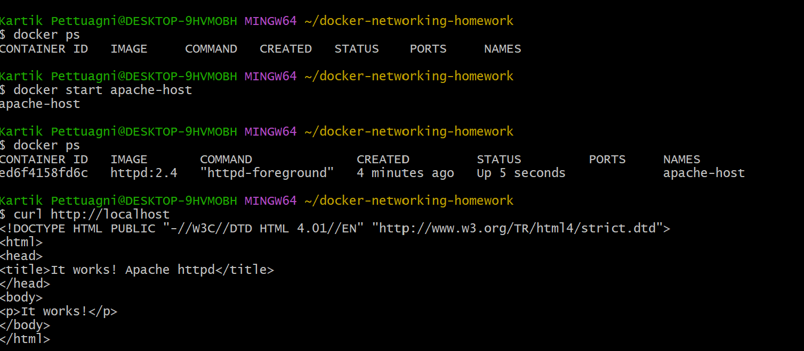
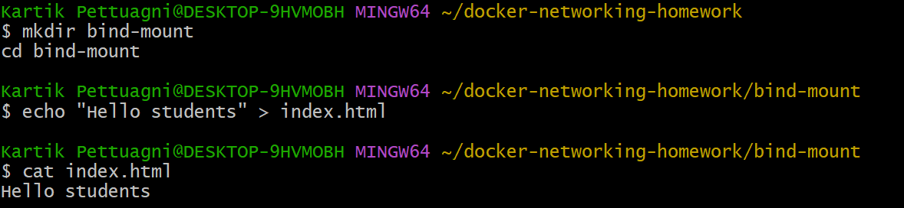
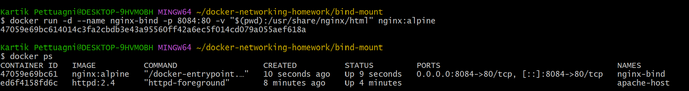
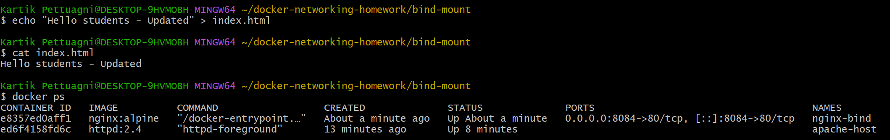
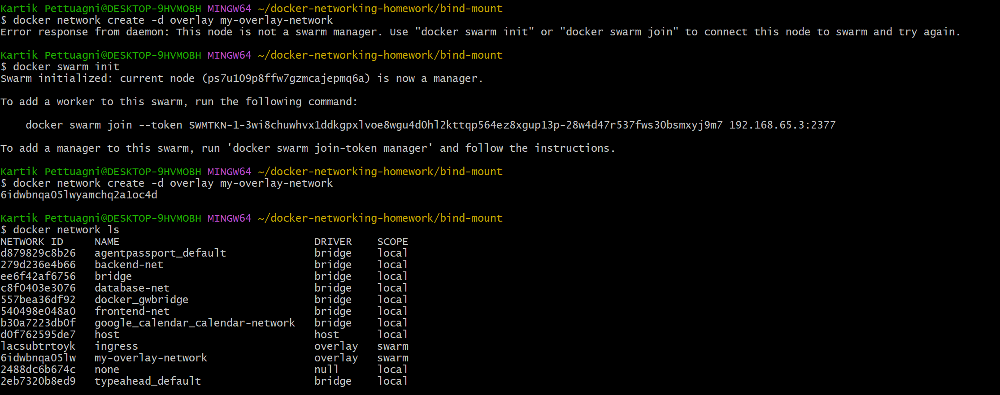

# Docker Networking & Volume Homework

## Task 1

### Create Docker Networks

**What it does:**  
Created three Docker networks: frontend-net, backend-net, and database-net.



### Create Containers



### Backend Network Configuration



### Container Connectivity



## Task 2

### Apache Host Network



### Apache Website


## Task 3

### Create index.html



### Nginx Bind Mount



### Initial Website


### Updated File



### Updated Website


## Task 4: Overlay Network

### What is an Overlay Network?

An overlay network is a Docker network that allows containers running
on different Docker hosts to communicate with each other.

It is mainly used with Docker Swarm for multi-host container
communication.

### Use Cases

- Communication between containers on different Docker hosts.
- Docker Swarm applications.
- Microservices running across multiple servers.
- Distributed applications.

### How it works

Docker creates a virtual network that spans multiple Docker hosts.
Containers connected to the same overlay network can communicate
with each other even when they are running on different machines.

### Command



```bash
docker swarm init

docker network create -d overlay my-overlay-network

docker network ls

