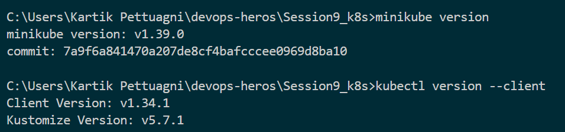
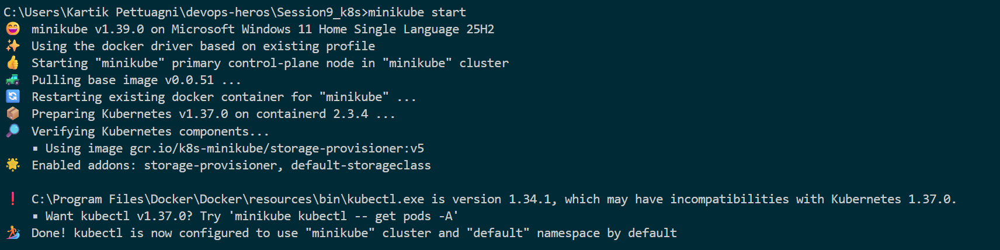
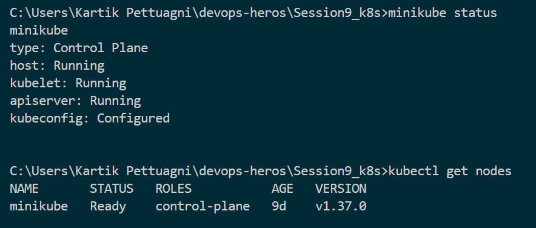
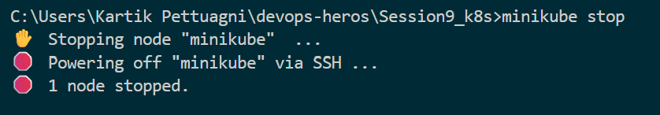

# Session 9: Kubernetes Fundamentals & Cluster Architecture

## Task 1: Minikube & CLI Installation Verification

Verify that Minikube and the Kubernetes CLI (`kubectl`) are successfully installed on the local system.

**Commands:**   
```bash
minikube version
kubectl version --client
```

**Output:**

```
minikube version: v1.39.0
commit: 7a9f6a841470a207de8cf4bafcccee0969d8ba10

Client Version: v1.34.1
Kustomize Version: v5.7.1
```

**Screenshot:**



---

## Task 2: Starting the Minikube Kubernetes Cluster

Initialize the local single-node Kubernetes cluster using the containerized runtime environment.

**Command:**

```bash
minikube start
```

**Output:**

```
😄  minikube v1.39.0 on Microsoft Windows 11 Home Single Language 25H2
✨  Using the docker driver based on existing profile
👍  Starting "minikube" primary control-plane node in "minikube" cluster
🚜  Pulling base image v0.0.51 ...
🔄  Restarting existing docker container for "minikube" ... 
📦  Preparing Kubernetes v1.37.0 on containerd 2.3.4 ...
🔎  Verifying Kubernetes components...
    ▪ Using image gcr.io/k8s-minikube/storage-provisioner:v5
🌟  Enabled addons: storage-provisioner, default-storageclass

❗  C:\Program Files\Docker\Docker\resources\bin\kubectl.exe is version 1.34.1, which may have incompatibilities with Kubernetes 1.37.0.
    ▪ Want kubectl v1.37.0? Try 'minikube kubectl -- get pods -A'
🏄  Done! kubectl is now configured to use "minikube" cluster and "default" namespace by default
```

**Screenshot:**



---

## Task 3: Verifying Cluster Status & Node Health

Inspect the status of the local cluster control plane, kubelet, API server, and verify the node is in `Ready` state.

**Commands:**

```bash
minikube status
kubectl get nodes -o wide
```

**Output:**

```
minikube
type: Control Plane
host: Running
kubelet: Running
apiserver: Running
kubeconfig: Configured

NAME       STATUS   ROLES           AGE   VERSION
minikube   Ready    control-plane   9d    v1.37.0
```

**Screenshot:**



---

## Task 4: Stopping the Minikube Cluster

Gracefully power down the Minikube cluster VM/container to release system resources.

**Command:**

```bash
minikube stop
```

**Output:**

```
✋  Stopping node "minikube"  ...
🛑  Powering off "minikube" via SSH ...
🛑  1 node stopped.
```

**Screenshot:**



---

## Task 5: Kubernetes Cluster Architecture & Component Analysis

Kubernetes consists of a **Control Plane** that manages the cluster and **Worker Nodes** that run applications.

### Control Plane Components

- **kube-apiserver** – Entry point for Kubernetes API requests and communication between components.
- **etcd** – Key-value database that stores the cluster's state and configuration.
- **kube-scheduler** – Selects suitable nodes for running new Pods.
- **kube-controller-manager** – Continuously ensures the actual cluster state matches the desired state.

### Worker Node Components

- **kubelet** – Manages Pods and containers on the node and reports their status.
- **kube-proxy** – Handles network rules and enables Service-to-Pod communication.
- **Container Runtime** – Runs containers, such as `containerd` or `CRI-O`.
- **Pod** – Smallest deployable unit that runs one or more containers.

### Architecture Flow

```text
Control Plane
     |
     v
kube-apiserver
     |
     +---- etcd
     +---- kube-scheduler
     +---- kube-controller-manager
     |
     v
Worker Node
     |
     +---- kubelet
     +---- kube-proxy
     +---- Container Runtime
     |
     v
    Pods