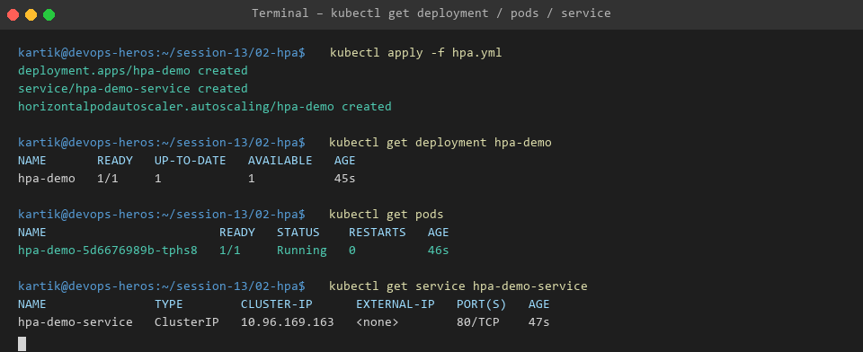
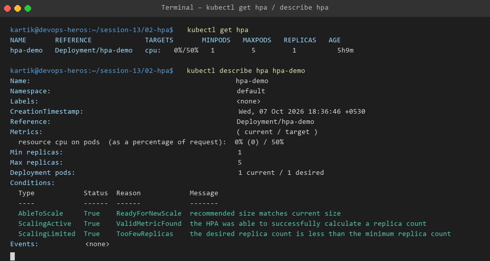
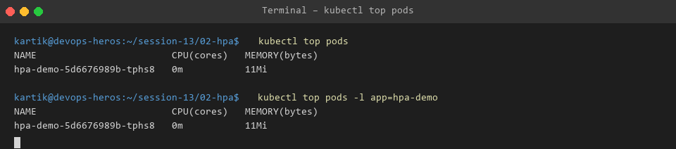
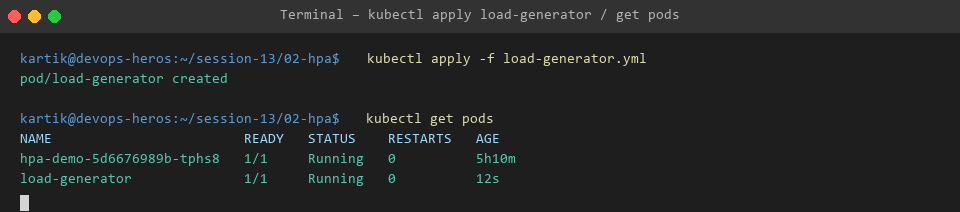
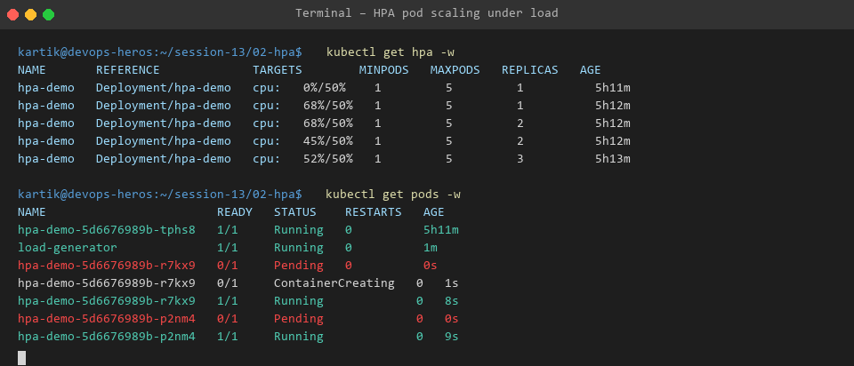

# Kubernetes HPA Hands-on

## Objective

The objective of this task was to deploy an application on Kubernetes, configure a Horizontal Pod Autoscaler, generate load, monitor CPU utilization, and observe automatic Pod scaling.

## Architecture

```text
                    Kubernetes Cluster
                           |
                           v
                    hpa-demo Service
                           |
                           v
                    hpa-demo Deployment
                           |
                +----------+----------+
                |                     |
                v                     v
             Pod 1                 Pod 2
                |
                |
        CPU Metrics from
        Metrics Server
                |
                v
               HPA
                |
                v
        Automatic Scaling
```

## Files

```text
02-hpa/
├── hpa.yml
├── load-generator.yml
├── README.md
└── screenshots/
```

## 1. Application Deployment

The application was deployed using:

```bash
kubectl apply -f hpa.yml
```

The deployment contains an Nginx application with CPU and memory resource requests and limits.

The application starts with one replica.

### Verification

```bash
kubectl get deployment
kubectl get pods
kubectl get service
```

### Screenshot



---

## 2. HPA Configuration

The Horizontal Pod Autoscaler was configured using the `autoscaling/v2` API.

The configuration uses CPU utilization as the scaling metric.

The application has:

```text
Minimum replicas: 1
Maximum replicas: 5
CPU target: 50%
```

The HPA monitors the Deployment and increases or decreases the number of Pods based on CPU utilization.

### Command

```bash
kubectl get hpa
```

### Detailed information

```bash
kubectl describe hpa hpa-demo
```

### Screenshot



---

## 3. CPU Monitoring

CPU and memory utilization were checked using:

```bash
kubectl top pods
```

This command retrieves resource metrics from the Kubernetes Metrics API.

### Screenshot



---

## 4. Load Generator

A BusyBox Pod was deployed to continuously send HTTP requests to the application.

The load generator was deployed using:

```bash
kubectl apply -f load-generator.yml
```

The Pod was verified using:

```bash
kubectl get pods
```

### Screenshot



---

## 5. Increasing Application Load

The load generator continuously sent requests to:

```text
http://hpa-demo
```

The increased traffic caused CPU utilization of the application Pod to increase.

CPU utilization was monitored using:

```bash
kubectl top pods
```

The HPA was monitored using:

```bash
kubectl get hpa -w
```

---

## 6. Observing Pod Scaling

The number of Pods was monitored using:

```bash
kubectl get pods -w
```

The HPA was monitored using:

```bash
kubectl get hpa -w
```

As CPU utilization increased above the configured target, the HPA increased the desired number of replicas.

### Scaling Observation

```text
Initial replicas: 1

CPU utilization increased due to load.

HPA detected increased CPU utilization.

Desired replicas increased.

Additional Pods were created.

The application continued serving traffic through the Service.
```

### Screenshot



---

## 7. Important Commands

### Check Pods

```bash
kubectl get pods
```

### Check HPA

```bash
kubectl get hpa
```

### Monitor CPU and Memory

```bash
kubectl top pods
```

### Inspect HPA

```bash
kubectl describe hpa hpa-demo
```

### Watch Pod Scaling

```bash
kubectl get pods -w
```

### Watch HPA Scaling

```bash
kubectl get hpa -w
```

---

## 8. How HPA Works

The basic flow is:

```text
Application receives traffic
          |
          v
CPU utilization increases
          |
          v
Metrics Server provides metrics
          |
          v
HPA evaluates CPU target
          |
          v
Desired replica count calculated
          |
          v
Deployment creates or removes Pods
```

In this project:

```text
CPU request = 100m
CPU target = 50%
```

Therefore, the HPA uses the CPU request as the reference for calculating CPU utilization.

---

## 9. Result

The Kubernetes application was successfully deployed and configured with a Horizontal Pod Autoscaler.

The load generator was used to create continuous traffic.

CPU utilization was monitored using the Metrics API.

The HPA automatically adjusted the number of application Pods according to the observed CPU utilization.

## Conclusion

This hands-on demonstrated how Kubernetes can automatically scale an application horizontally based on resource utilization.

The main components used were:

```text
Deployment
    |
    +-- Nginx application
    |
Service
    |
    +-- Provides access to application
    |
Metrics Server
    |
    +-- Provides CPU metrics
    |
HPA
    |
    +-- Automatically changes replica count
    |
Load Generator
    |
    +-- Generates application traffic
```
