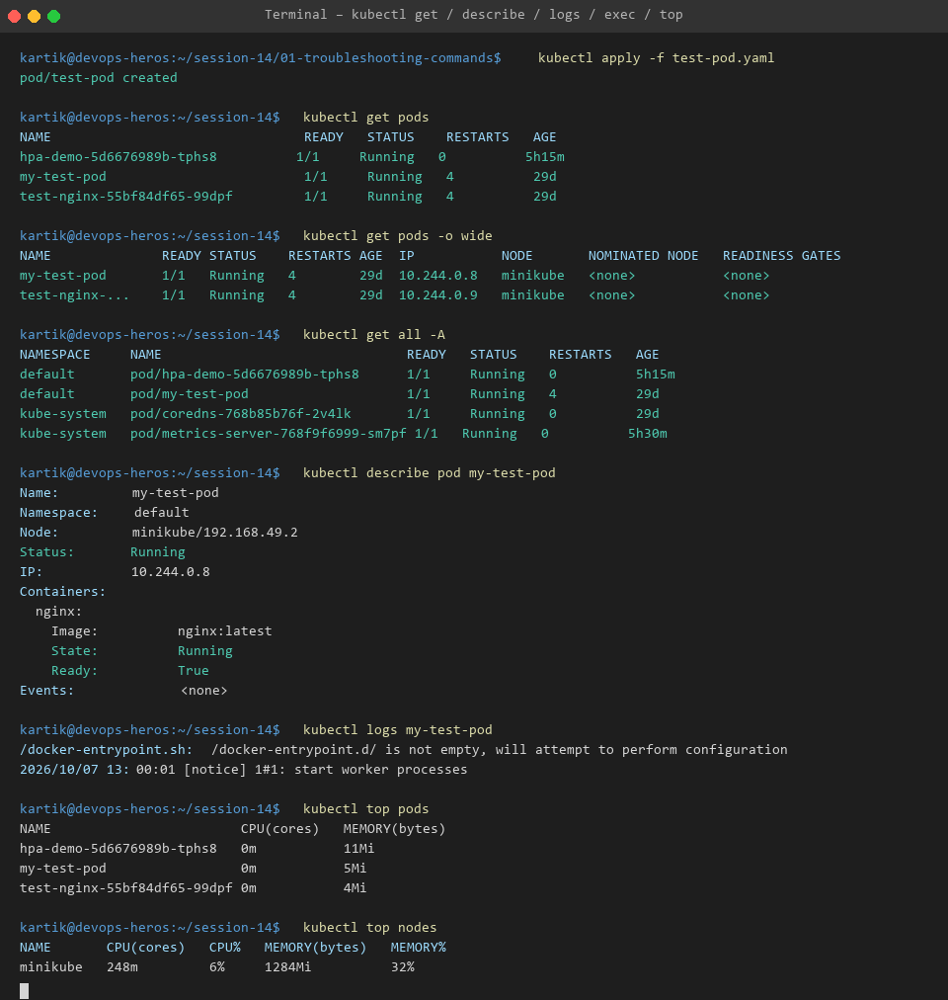

# Session 14 - Task 1: Essential Kubernetes Troubleshooting Commands

This directory documents hands-on usage and deep dive explanations of the primary Kubernetes CLI (`kubectl`) commands used by DevOps engineers to debug, observe, and troubleshoot cluster workloads.

---

## 🛠️ Core Troubleshooting Commands Reference

### 1. `kubectl get`
Lists resources of a specific type in the cluster.
```bash
# List all pods in the current namespace
kubectl get pods

# List pods with wide output (IP address, Node name, Readyness)
kubectl get pods -o wide

# List all resources across all namespaces
kubectl get all -A
```

### 2. `kubectl describe`
Retrieves detailed information about a resource, including configuration specs, status condition history, and cluster events.
```bash
# Describe a specific pod
kubectl describe pod test-pod

# Describe nodes to inspect resource allocation and taints
kubectl describe node minikube
```

### 3. `kubectl logs`
Streams or prints stdout and stderr logs from container instances inside a pod.
```bash
# View recent logs from pod
kubectl logs test-pod

# Stream live log output (-f flag)
kubectl logs -f test-pod

# Fetch logs from a previous crashed container instance (--previous)
kubectl logs test-pod --previous
```

### 4. `kubectl exec`
Executes interactive terminal shell sessions or single commands directly inside a running container.
```bash
# Open interactive bash/sh shell inside container
kubectl exec -it test-pod -- /bin/sh

# Test internal network connectivity to localhost
kubectl exec test-pod -- curl -I http://localhost:80
```

### 5. `kubectl events`
Displays chronological cluster lifecycle events (Warnings, Normal events, failures).
```bash
# View recent cluster events sorted by timestamp
kubectl events --sort-by='.metadata.creationTimestamp'

# Filter warning events only
kubectl get events --field-selector type=Warning
```

### 6. `kubectl explain`
Navigates Kubernetes API documentation directly from terminal.
```bash
# Inspect Pod specification documentation
kubectl explain pod.spec.containers

# Inspect Liveness probe options
kubectl explain pod.spec.containers.livenessProbe
```

### 7. `kubectl top`
Displays real-time CPU and Memory resource usage statistics for Nodes and Pods (requires Metrics Server).
```bash
# View pod resource utilization
kubectl top pods

# View node resource utilization
kubectl top nodes
```

---

## 📸 Output Verification



---

## 🎯 Key Takeaways
- Always inspect **`kubectl describe`** first when a pod fails to start, as the `Events:` section highlights scheduler, pull, and volume binding issues.
- Use **`kubectl logs --previous`** to catch root-cause stack traces of containers trapped in `CrashLoopBackOff`.
