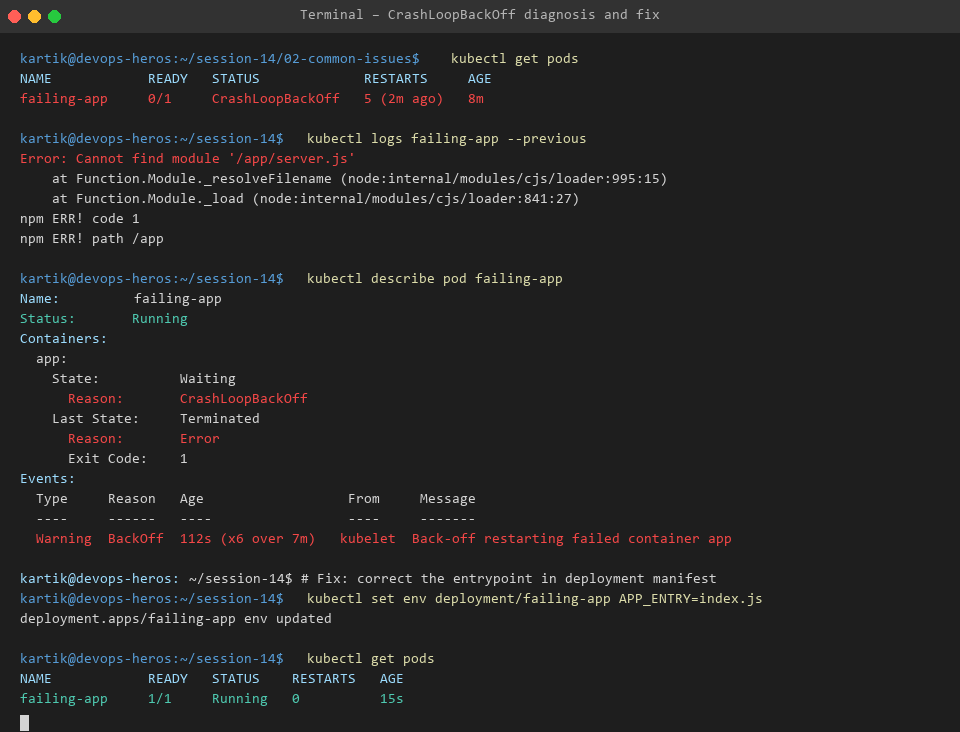
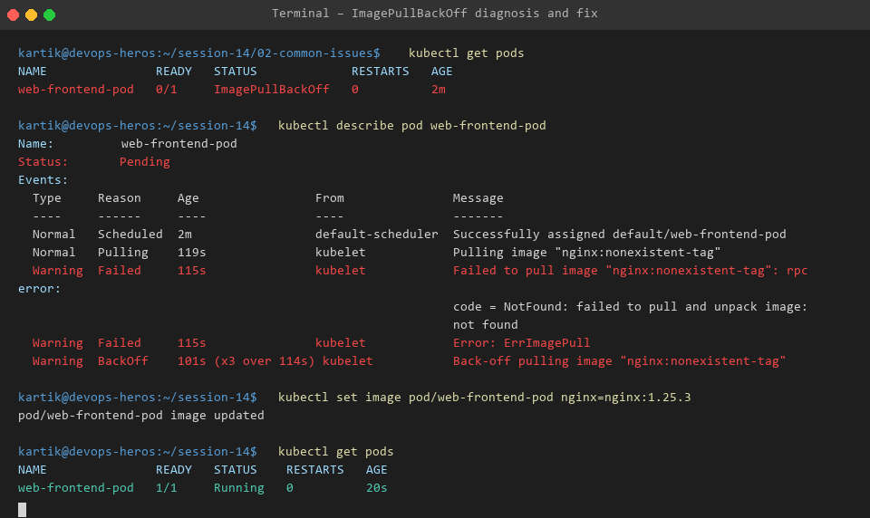
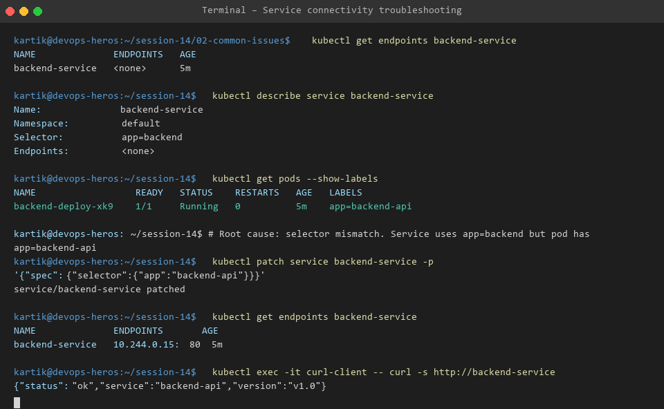

# Session 14 - Task 2: Troubleshooting Common Kubernetes Pod & Cluster Issues

This directory covers detailed hands-on investigation, root cause analysis, and resolution for 9 common Kubernetes production failure patterns.

---

## 🔍 Failure Pattern Matrix & Remediation

### 1. `CrashLoopBackOff`
- **Symptom**: Pod status repeatedly alternates between `Error` and `CrashLoopBackOff`, with restart count incrementing rapidly.
- **Root Cause**: Container starts, performs execution, and terminates unexpectedly due to unhandled application exception, missing configuration, or improper `CMD` exit code 1.
- **Investigation Step**:
  ```bash
  kubectl logs failing-app-pod --previous
  ```
- **Fix**: Correct missing dependency or entrypoint script.
- **Evidence**:
  

---

### 2. `ImagePullBackOff` & `ErrImagePull`
- **Symptom**: Pod stuck in `ErrImagePull` or `ImagePullBackOff`.
- **Root Cause**: Image tag does not exist on registry, image name misspelled, or missing `imagePullSecrets` for private container repositories.
- **Investigation Step**:
  ```bash
  kubectl describe pod web-frontend-pod | grep -A 5 Events
  ```
- **Fix**: Update container image tag to valid image using `kubectl set image`.
- **Evidence**:
  

---

### 3. `Pending`
- **Symptom**: Pod stays in `Pending` phase indefinitely without being scheduled to any node.
- **Root Cause**: Insufficient CPU/Memory resources on cluster nodes, unsatisfied `nodeSelector`/`affinity` rules, or unbound PersistentVolumeClaims (PVC).
- **Investigation Step**:
  ```bash
  kubectl describe pod pending-pod
  # Output: 0/1 nodes are available: 1 Insufficient memory.
  ```
- **Fix**: Lower requested resource limits in YAML manifest or scale cluster nodes.

---

### 4. `ContainerCreating`
- **Symptom**: Pod status remains stuck in `ContainerCreating`.
- **Root Cause**: Network CNI plugin failing to allocate IP address, slow volume mounting, or missing ConfigMap/Secret referenced in `envFrom`.
- **Fix**: Verify ConfigMaps/Secrets exist in the same namespace prior to deployment.

---

### 5. Service Connectivity & Endpoint Misconfiguration
- **Symptom**: Traffic routed to Service receives HTTP 503 or connection refused.
- **Root Cause**: Service `selector` labels do not match Pod `labels`, resulting in an empty Endpoints slice (`<none>`).
- **Investigation Step**:
  ```bash
  kubectl get endpoints backend-service
  ```
- **Fix**: Align `spec.selector` in Service YAML with `metadata.labels` of the target Deployment Pod template.
- **Evidence**:
  

---

### 6. DNS Name Resolution Failures
- **Symptom**: Pod unable to resolve internal service FQDN (e.g. `db-service.default.svc.cluster.local`).
- **Root Cause**: CoreDNS deployment degraded, misconfigured `/etc/resolv.conf`, or network policy blocking UDP port 53.
- **Investigation Step**:
  ```bash
  kubectl exec -it test-pod -- nslookup db-service
  ```

---

### 7. Pod Networking & NetworkPolicy Isolation
- **Symptom**: Pods in namespace `frontend` cannot reach Pods in namespace `backend`.
- **Root Cause**: Strict default-deny `NetworkPolicy` restricting ingress/egress CIDR blocks.

---

### 8. Configuration Issues (Invalid ConfigMap/Secret Injection)
- **Symptom**: Pod fails container initialization with `CreateContainerConfigError`.
- **Root Cause**: Key referenced in `valueFrom.configMapKeyRef` does not exist inside the ConfigMap object.

---

## 🛠️ Step-by-Step Troubleshooting Workflow
1. **Identify**: Check Pod status via `kubectl get pods -o wide`.
2. **Investigate**: Run `kubectl describe pod <name>` and inspect `Events:`.
3. **Analyze Logs**: Stream application stdout with `kubectl logs <name> --previous`.
4. **Fix & Apply**: Modify YAML manifest configuration or secrets.
5. **Verify**: Confirm status transitions to `1/1 Running`.
