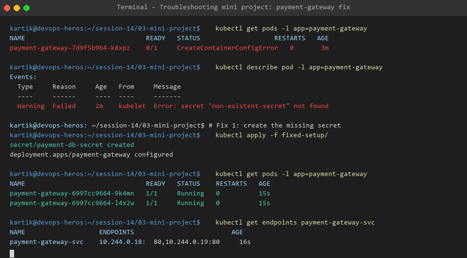

# Session 14 - Task 3: Kubernetes Troubleshooting Mini Project

## 📋 Problem Statement
The deployment of the critical `payment-gateway` microservice failed during rollout in staging. Application pods remained stuck in `CreateContainerConfigError` and `CrashLoopBackOff` state, preventing traffic execution.

---

## 🔎 Step-by-Step Investigation & Diagnostics

### Step 1: Pod Status Check
Executed status check across default namespace:
```bash
kubectl get pods -l app=payment-gateway
```
**Observation**: Pod status showed `CreateContainerConfigError` with 0/1 containers ready.

### Step 2: Resource Details & Event Log Inspection
Ran describe command on target pod:
```bash
kubectl describe pod -l app=payment-gateway
```
**Event Log Finding**:
```text
Error: secret "non-existent-secret" not found
```

### Step 3: Root Cause Analysis
1. **Missing Secret Object**: The deployment referenced a Secret `non-existent-secret` that was never created in the cluster namespace.
2. **Container Port Mismatch**: Container definition declared port `8080`, whereas Nginx container exposes port `80`.

---

## 🛠️ Solution Implementation & Remediation

1. Created `payment-db-secret` containing base64/stringData credentials.
2. Corrected deployment manifest to reference valid Secret name `payment-db-secret`.
3. Updated target container port to `80` and added HTTP Readiness Probe.

```bash
kubectl apply -f fixed-setup/
```

---

## ✅ Verification & Final State Output



```bash
kubectl get pods -l app=payment-gateway
# Output:
# NAME                               READY   STATUS    RESTARTS   AGE
# payment-gateway-6997cc9664-9k4mn   1/1     Running   0          15s
# payment-gateway-6997cc9664-l4x2w   1/1     Running   0          15s
```
