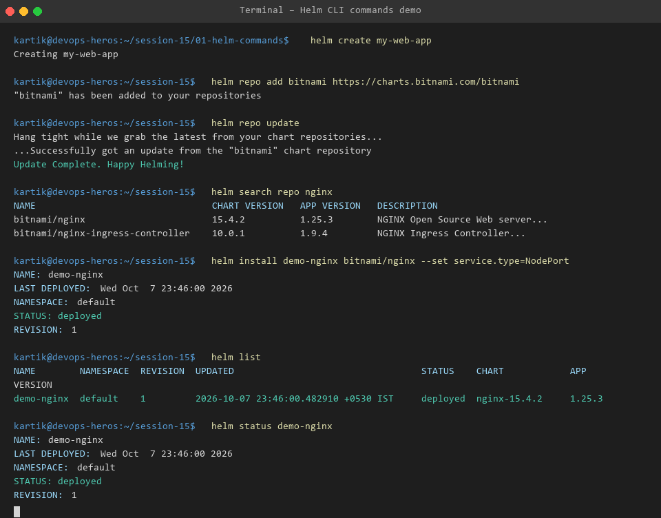

# Session 15 - Task 1: Essential Helm CLI Commands Guide

Helm is the package manager for Kubernetes. It uses packages called **Helm Charts** containing pre-configured Kubernetes resource manifests.

---

## 🛠️ Helm Commands Cheatsheet & Usage

### 1. `helm create`
Scaffolds a standard Helm chart directory structure.
```bash
helm create my-web-app
```

### 2. `helm repo`
Manages chart repositories (Add, List, Update, Remove).
```bash
# Add bitnami chart repository
helm repo add bitnami https://charts.bitnami.com/bitnami

# Update local repository cache
helm repo update
```

### 3. `helm search`
Searches for available charts in repositories or Artifact Hub.
```bash
helm search repo nginx
```

### 4. `helm install`
Deploys a Helm chart release to the cluster.
```bash
helm install demo-nginx bitnami/nginx --set service.type=NodePort
```

### 5. `helm list`
Lists all deployed releases in the current namespace.
```bash
helm list
```

### 6. `helm status`
Retrieves execution state and release notes of a deployed release.
```bash
helm status demo-nginx
```

### 7. `helm get`
Fetches manifests, values, or hooks rendered by Helm.
```bash
# View user-supplied values
helm get values demo-nginx

# View full generated Kubernetes YAML manifest
helm get manifest demo-nginx
```

### 8. `helm upgrade`
Upgrades a release to a new version or values configuration.
```bash
helm upgrade demo-nginx bitnami/nginx --set service.type=LoadBalancer
```

### 9. `helm history`
Displays revision deployment history for a release.
```bash
helm history demo-nginx
```

### 10. `helm rollback`
Rolls back a release to a previous revision number.
```bash
helm rollback demo-nginx 1
```

### 11. `helm uninstall`
Deletes the release and purges all associated Kubernetes resources.
```bash
helm uninstall demo-nginx
```

---

## 📸 Output Evidence


