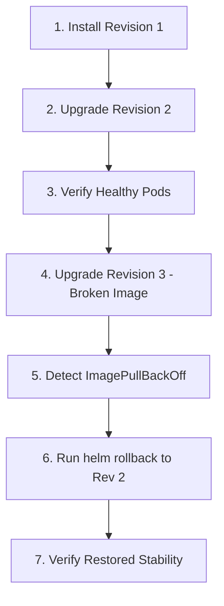
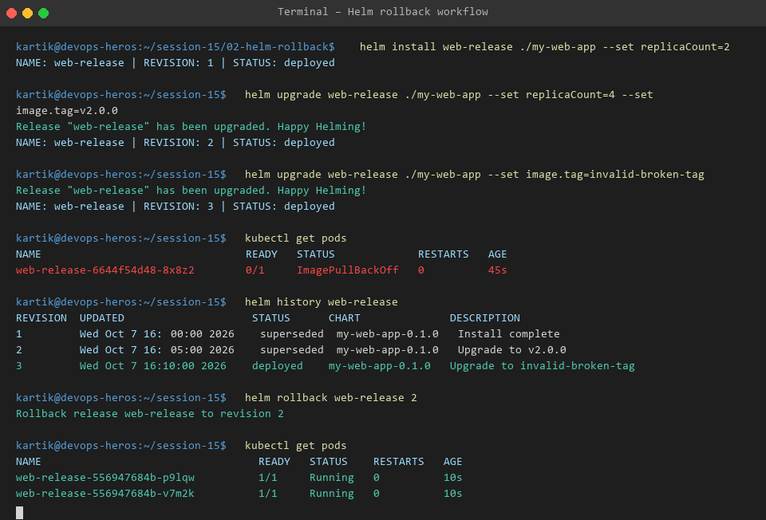

# Session 15 - Task 2: Helm Upgrade & Rollback Workflow

This task demonstrates zero-downtime application updates and instant rollbacks using Helm's revision tracking mechanism.

---

## 🔄 Complete Step-by-Step Rollback Workflow



### Step 1: Initial Chart Installation (Revision 1)
```bash
helm install web-release ./my-web-app --set replicaCount=2
```

### Step 2: Perform Application Upgrade (Revision 2)
Scale application replicas to 4 and update image tag:
```bash
helm upgrade web-release ./my-web-app --set replicaCount=4 --set image.tag=v2.0.0
```

### Step 3: Verify Revision 2 Health
```bash
kubectl get pods -l app.kubernetes.io/name=my-web-app
# Output: 4/4 pods Running successfully
```

### Step 4: Deploy Faulty Version (Revision 3)
Intentionally supply a non-existent container tag:
```bash
helm upgrade web-release ./my-web-app --set image.tag=invalid-broken-tag
```

### Step 5: Detect Failure State
```bash
kubectl get pods
# Output: status ImagePullBackOff
```

### Step 6: Execute Rollback
Roll back to Revision 2:
```bash
helm rollback web-release 2
```

### Step 7: Verify Recovery
```bash
helm history web-release
kubectl get pods
```

---

## 📷 Workflow Output Evidence


