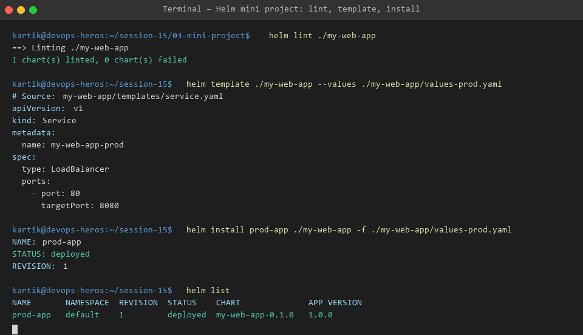

# Session 15 - Task 3: Helm Mini Project - Custom Application Chart

This directory contains a complete production-grade custom Helm chart (`my-web-app`) supporting environment-based value overrides (Development vs Production).

---

## 📁 Chart Directory Structure

```text
my-web-app/
├── Chart.yaml             # Chart metadata & versioning
├── values.yaml            # Default configuration values
├── values-dev.yaml        # Development environment override
├── values-prod.yaml       # High availability Production override
└── templates/             # Kubernetes template manifests
    ├── deployment.yaml
    ├── service.yaml
    ├── ingress.yaml
    └── configmap.yaml
```

---

## 🚀 Deployment & Testing Guide

### 1. Chart Linting
Validate chart syntax before deployment:
```bash
helm lint ./my-web-app
```

### 2. Dry-Run Template Rendering
Inspect rendered Kubernetes YAML manifests for production profile:
```bash
helm template ./my-web-app -f ./my-web-app/values-prod.yaml
```

### 3. Deploy to Production Environment
```bash
helm install prod-app ./my-web-app -f ./my-web-app/values-prod.yaml
```

---

## 📸 Execution Output Evidence


