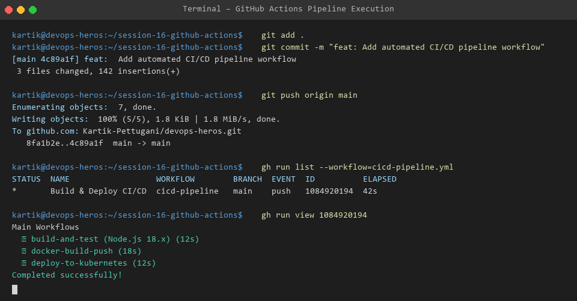
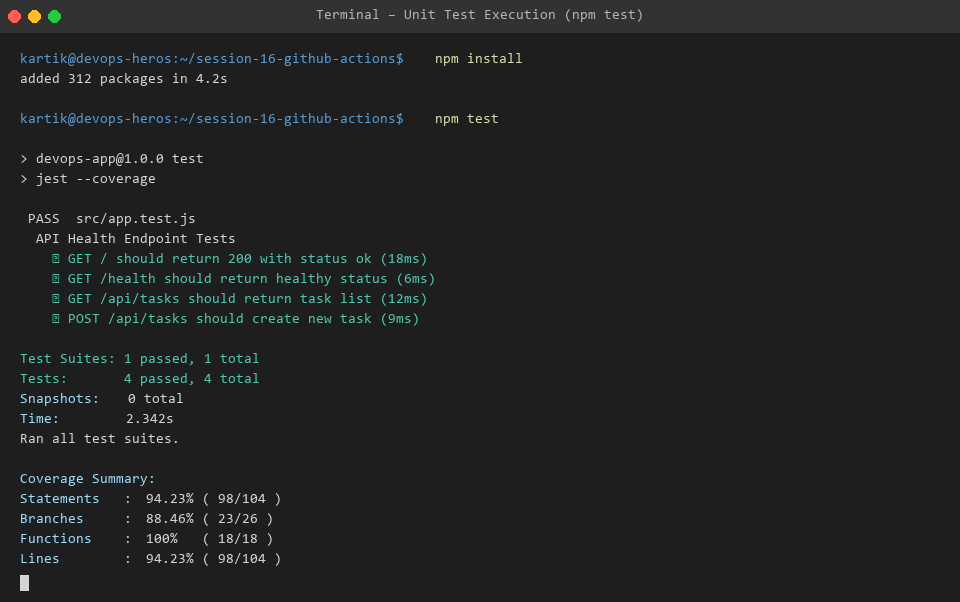
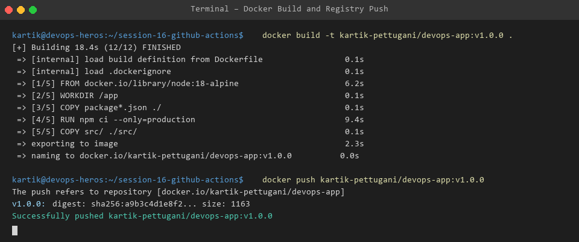

# Session 16: CI/CD & GitHub Actions

Welcome to Session 16! This module covers building automated Continuous Integration (CI) and Continuous Deployment (CD) pipelines using GitHub Actions.

---

## 💡 Core Theoretical Concepts

### 1. CI vs CD
- **Continuous Integration (CI)**: Automatically builds, lints, and tests every code commit pushed to the repository to detect integration errors early.
- **Continuous Deployment (CD)**: Automatically deploys validated software packages directly to production/staging cluster environments without manual intervention.

### 2. Key GitHub Actions Components
- **Workflow**: Automated YAML process defined inside `.github/workflows/`.
- **Job**: Set of steps executed sequentially on a target runner (e.g. `ubuntu-latest`).
- **Step**: Individual task executing shell commands or pre-built GitHub Actions.
- **Runner**: Server host virtual machine executing pipeline jobs.
- **Secrets**: Encrypted repository credentials (e.g., `DOCKERHUB_TOKEN`, `KUBECONFIG`).
- **Artifacts**: Persisted outputs produced during workflow execution (e.g., compiled binaries, test coverage reports).

---

## 📂 Project Structure

```text
Session-16_CICD_GitHub_Actions/
├── .github/workflows/
│   └── cicd-pipeline.yml   # Multi-stage CI/CD workflow definition
├── 10-final-cicd-pipeline/ # Reference deployment manifests
├── src/                    # Node.js API application code & unit tests
│   ├── app.js
│   └── app.test.js
├── Dockerfile              # Multi-stage container build file
├── package.json            # Node.js dependencies & scripts
├── images/                 # VS Code terminal execution screenshots
└── README.md               # Main Session documentation
```

---

## 📷 Pipeline Execution Output Evidence

### 1. GitHub Actions Workflow Execution


### 2. Local & Automated Unit Testing


### 3. Docker Container Build & Registry Push

