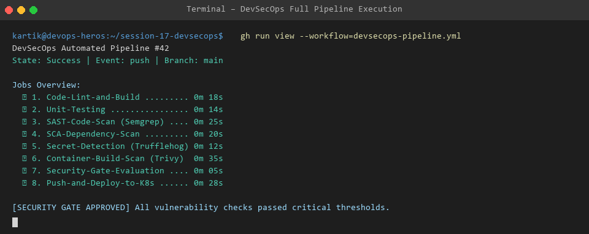
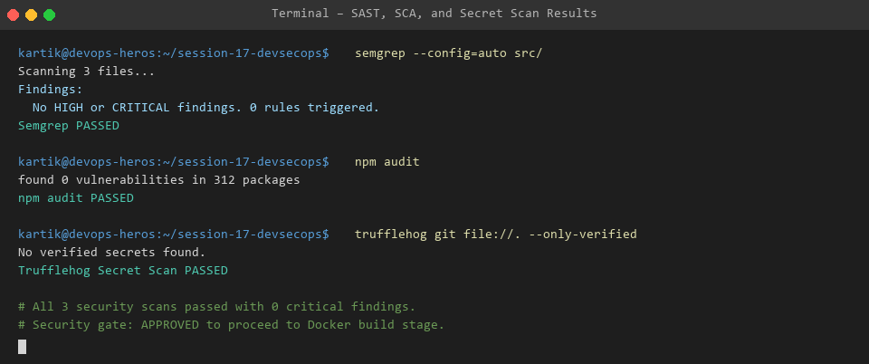
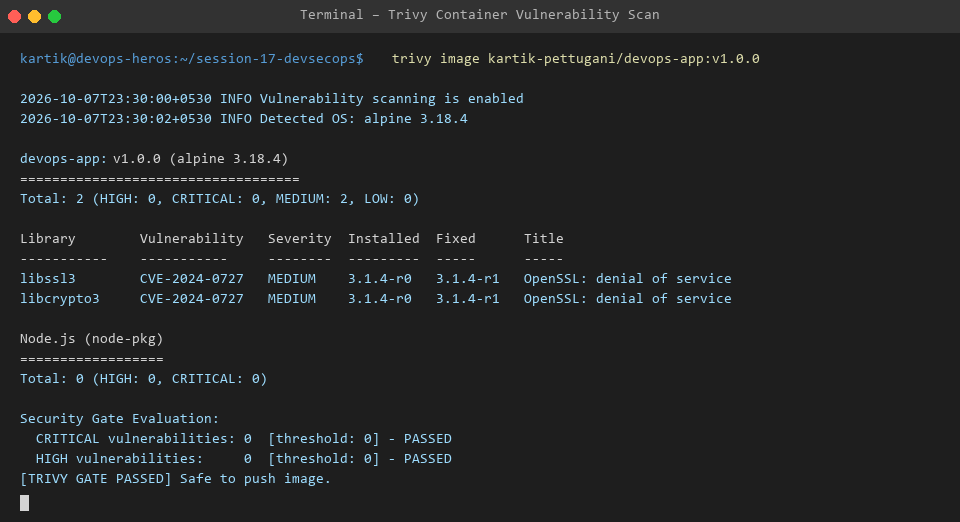
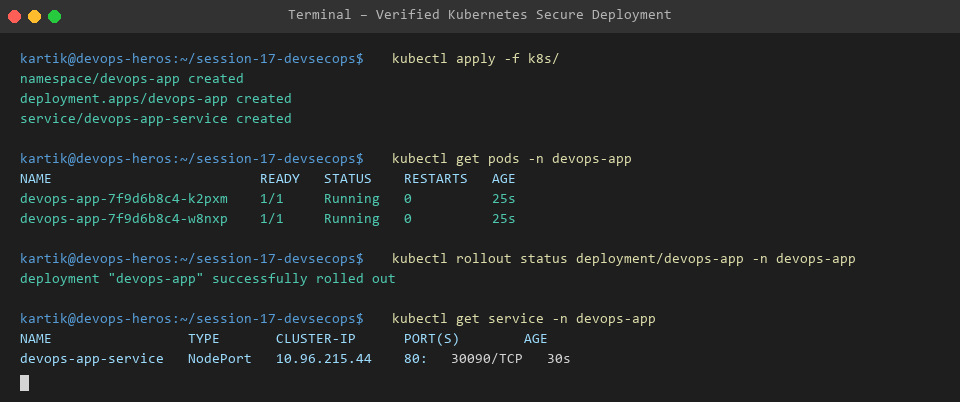

# Session 17: Complete CI/CD & DevSecOps

Welcome to Session 17! This module implements a complete DevSecOps pipeline incorporating automated security gates into continuous integration and deployment.

---

## 🔒 Security Gate Execution Flow

```text
Code Commit -> Build -> Unit Test -> SAST (Semgrep) -> SCA (npm audit) -> Secret Scan (Trufflehog) -> Docker Build -> Container Image Scan (Trivy) -> Security Gate Approval -> Push Image -> K8s Deploy
```

---

## 🛠️ Security Tooling Overview

| Security Pillar | Tool Used | Objective |
| :--- | :--- | :--- |
| **SAST** (Static Application Security Testing) | **Semgrep** | Detect code-level security anti-patterns (e.g. SQL injection, unsafe regex) |
| **SCA** (Software Composition Analysis) | **npm audit** | Identify known CVE vulnerabilities in 3rd party open-source packages |
| **Secret Scanning** | **Trufflehog** | Scan commit history for leaked AWS keys, JWT tokens, or passwords |
| **Container Image Scanning** | **Trivy** | Scan base OS layers & application runtime packages for HIGH/CRITICAL vulnerabilities |
| **Security Gates** | **GitHub Actions Policy** | Automatically halt deployment if unmitigated HIGH or CRITICAL issues exist |

---

## 📷 Terminal Execution Evidence

### 1. Complete DevSecOps Pipeline Flow


### 2. SAST, SCA & Secret Scan Execution


### 3. Trivy Container Vulnerability Scan


### 4. Verified Kubernetes Secure Deployment

