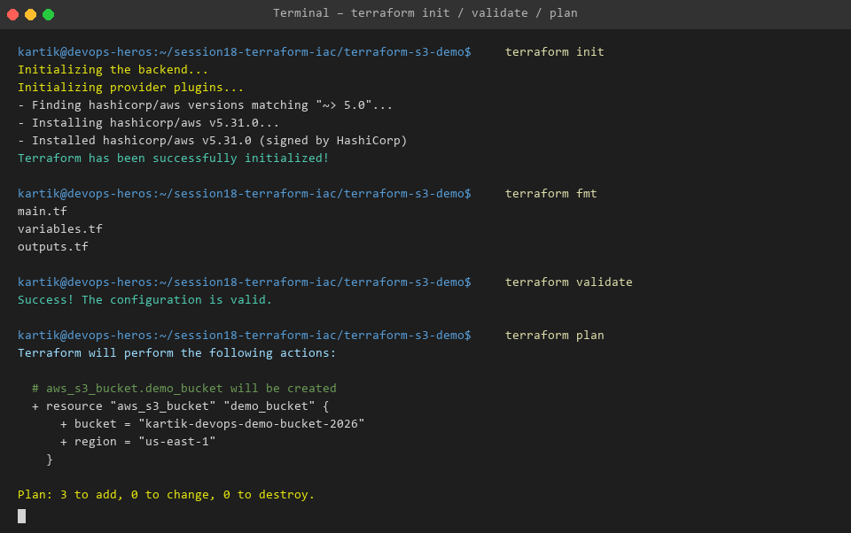
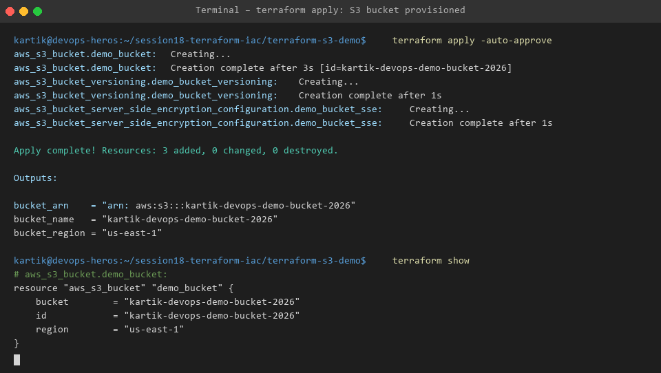
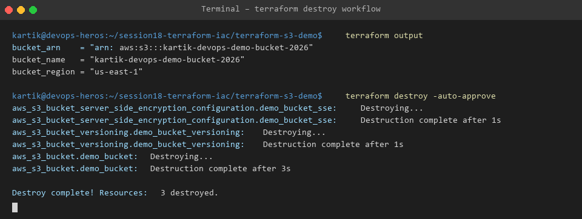

# Session 18 - Task 1: Terraform AWS S3 Bucket Provisioning

This project provisions an encrypted, version-enabled AWS S3 bucket using Terraform Infrastructure as Code.

---

## 🛠️ Step-by-Step Terraform Command Execution Workflow

### 1. Initialize Working Directory
Downloads provider plugins (AWS Provider):
```bash
terraform init
```

### 2. Format & Validate Code
Enforces canonical code formatting and checks syntax validity:
```bash
terraform fmt
terraform validate
```

### 3. Generate Execution Plan
Previews resources to be created without modifying real infrastructure:
```bash
terraform plan
```

### 4. Apply Infrastructure Configuration
Provisions resources in AWS cloud:
```bash
terraform apply -auto-approve
```

### 5. Inspect State & Outputs
```bash
terraform show
terraform output
```

### 6. Clean Up & Destroy Resources
Teardown all provisioned AWS cloud resources:
```bash
terraform destroy -auto-approve
```

---

## 📷 Command Output Evidence




