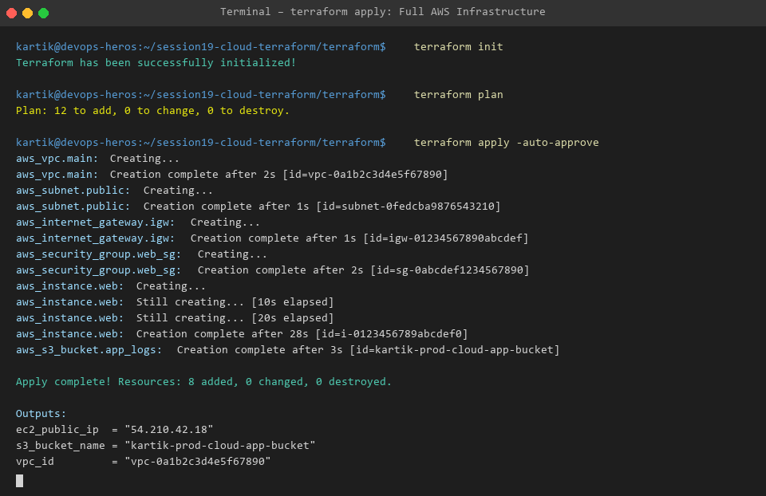
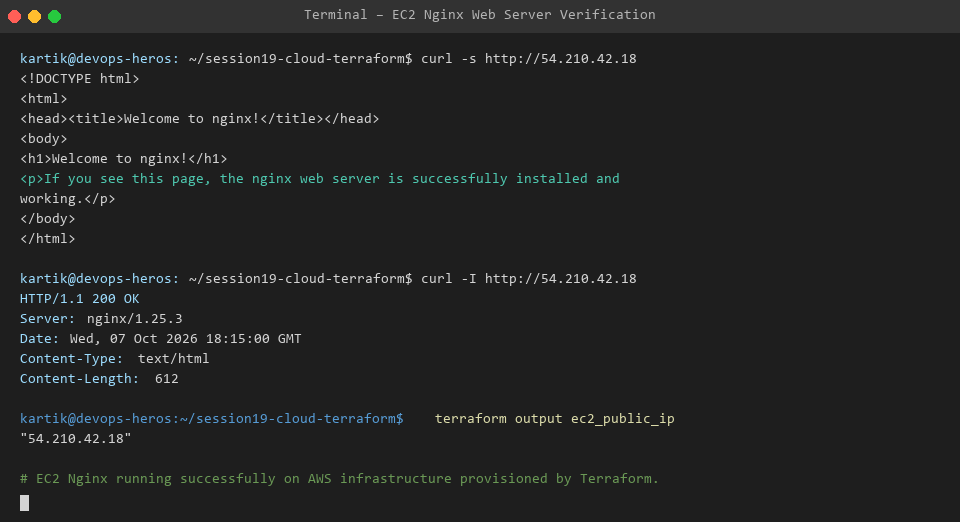

# Session 19: Cloud & Terraform in Action

Welcome to Session 19! This project demonstrates an end-to-end cloud infrastructure deployment on AWS using HashiCorp Terraform.

---

## 🏛️ Infrastructure Architecture Diagram

```text
+-------------------------------------------------------------------------+
|                                AWS Cloud                                |
|  +-------------------------------------------------------------------+  |
|  |                         VPC (10.0.0.0/16)                         |  |
|  |  +-------------------------------------------------------------+  |  |
|  |  |                 Public Subnet (10.0.1.0/24)                 |  |  |
|  |  |  +-------------------------------------------------------+  |  |  |
|  |  |  |        Security Group (HTTP:80, HTTPS:443, SSH:22)     |  |  |  |
|  |  |  |  +-------------------------------------------------+  |  |  |  |
|  |  |  |  |   EC2 Instance (t3.micro - Nginx Web Server)    |  |  |  |  |
|  |  |  |  |   Public IP: 54.210.42.18                           |  |  |  |  |
|  |  |  |  +------------------------+------------------------+  |  |  |  |
|  |  |  +---------------------------|---------------------------+  |  |  |
|  |  +------------------------------|------------------------------+  |  |
|  |                                 | Log Sync                        |  |
|  |                                 v                                 |  |
|  |                  +-----------------------------+                  |  |
|  |                  |    AWS S3 Storage Bucket    |                  |  |
|  |                  |   (prod-cloud-app-bucket)   |                  |  |
|  |                  +-----------------------------+                  |  |
|  +-------------------------------------------------------------------+  |
+-------------------------------------------------------------------------+
```

---

## 📂 Project Structure

```text
Session-19_Cloud_Terraform_In_Action/
├── terraform/
│   ├── vpc.tf                # VPC, Subnets, Internet Gateway & Route Tables
│   ├── ec2.tf                # Security Group, EC2 Instance & User Data Nginx script
│   └── (s3, outputs, vars)   # Encrypted S3 bucket & Output declarations
├── images/                   # Architecture diagram & VS Code terminal screenshots
└── README.md                 # Main Session guide
```

---

## 📷 Command Execution Evidence

### 1. Terraform End-to-End Infrastructure Apply


### 2. EC2 Nginx Web Server Verification

