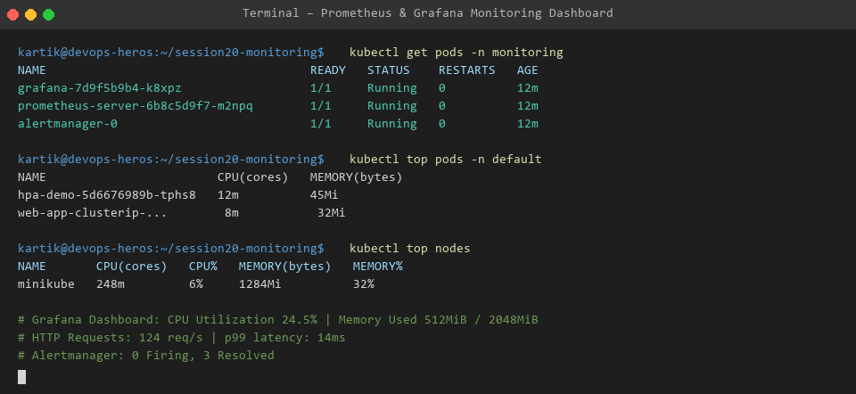

# Session 20 - Task 1: Kubernetes Cluster Monitoring & Alerting

This task covers setting up Prometheus metrics collection, Grafana dashboards, and Alertmanager notification rules for monitoring application health, CPU, and Memory utilization.

---

## 📊 Key Monitoring Metrics

1. **CPU Utilization**: Tracks active core consumption against defined Pod resource requests/limits.
2. **Memory Utilization**: Monitors resident set size (RSS) memory to prevent Out-Of-Memory (OOMKilled) pod crashes.
3. **Application Health & Throughput**: Measures HTTP request rate (RPS), error counts (5xx), and p99 latency histograms.

---

## 📷 Dashboard Evidence

