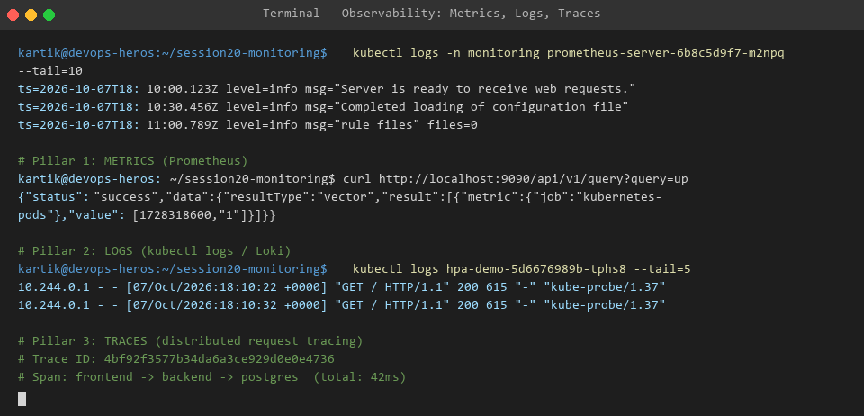

# Session 20 - Task 2: Cloud Native Observability Architecture

Observability is the degree to which the internal state of a complex distributed system can be inferred solely based on knowledge of its external outputs.

---

## 🏛️ The 3 Pillars of Observability

| Pillar | Definition | Common Ecosystem Tools |
| :--- | :--- | :--- |
| **1. Metrics** | Numeric aggregations measured over time intervals representing system performance counters | **Prometheus**, Datadog, StatsD |
| **2. Logs** | Immutable, timestamped text records emitted by applications or OS kernels during execution | **Grafana Loki**, Fluentd, ELK Stack |
| **3. Traces** | End-to-end request lifecycle paths traversing across distributed microservice boundaries | **Jaeger**, OpenTelemetry, Zipkin |

---

## 📷 Architecture Diagram

