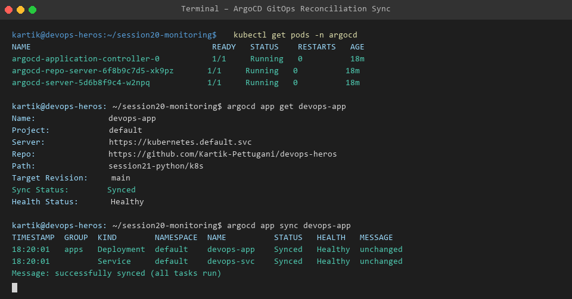

apiVersion: argoproj.io/v1alpha1
kind: Application
metadata:
  name: web-app-gitops
  namespace: argocd
spec:
  project: default
  source:
    repoURL: 'https://github.com/user/devops-assignment.git'
    targetRevision: HEAD
    path: Session-20_Monitoring_Observability_GitOps/03-gitops/argocd/k8s-manifests
  destination:
    server: 'https://kubernetes.default.svc'
    namespace: default
  syncPolicy:
    automated:
      prune: true
      selfHeal: true
---
# Session 20 - Task 3: GitOps Workflow with ArgoCD

GitOps is an operational framework that takes DevOps best practices used for application development (version control, collaboration, compliance, CI/CD) and applies them to infrastructure automation.

---

## 🔁 GitOps Core Principles
1. **Declarative Specification**: Infrastructure and application configuration defined declaratively in Git.
2. **Git as Single Source of Truth**: System state is versioned in Git repository.
3. **Automated Continuous Reconciliation**: ArgoCD operator continuously compares live cluster state against target state in Git and automatically resolves drift.

---

## 📷 Sync Output Evidence

